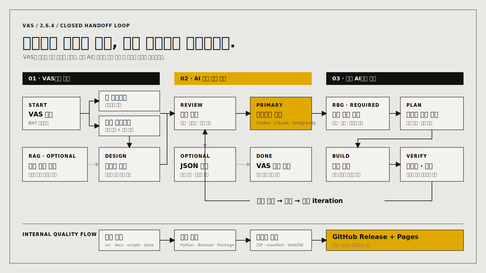

# VAS 2.6.4

VAS는 `작업·디자인 설정 → 프롬프트 생성 → 코딩 AI 전달`을 위한 로컬 도구입니다.

## 한눈에 보는 작업 흐름



## 사용 방법

1. ZIP을 새 폴더에 전부 압축 해제합니다.
2. `Run-VAS-System.bat`를 더블클릭합니다.
3. **새 프로젝트 만들기** 또는 **기존 프로그램 AI로 연결**을 고릅니다.
4. 이전 디자인 선택을 추천받을지 직접 고릅니다. 작업 기억 원본은 인계에 포함되지 않습니다.
5. Codex·Claude·Antigravity에서 실제 작업 폴더를 열고 프롬프트를 붙여넣습니다.

프롬프트를 복사한 뒤에는 VAS를 닫아도 됩니다. `VAS-AI-HANDOFF.json` 저장은 선택입니다. 화면 위의 **사용 방법**은 어느 단계에서든 다시 열 수 있고, 완료 화면에서 작업 기억 설정을 다시 바꿀 수 있습니다.

VAS는 기존 프로그램의 구조나 기술 스택을 추정하지 않습니다. 선택한 폴더 위치는 복사되는 프롬프트에만 들어가며 JSON·작업 기억에는 저장하지 않습니다. 코딩 AI는 RBG(Read Before Generate) 규칙에 따라 실제 원본부터 읽고 작업합니다.

자세한 설명은 [`00-처음-사용하기.txt`](00-처음-사용하기.txt), 시스템 구조는 [docs/index.md](docs/index.md)를 확인하세요.

## 검증·배포

```powershell
npm.cmd run knowledge:index
npm.cmd run test:python
npm.cmd run test:browser
npm.cmd run test:package
```

10회 스트레스 검사는 명시적으로 필요할 때만 `npm.cmd run test:release`로 실행합니다.
