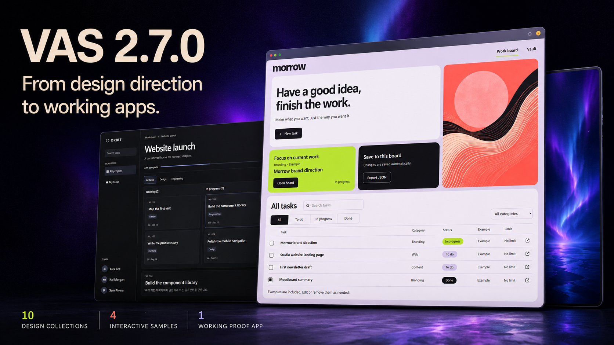

# VAS 2.7.5



**From design direction to working apps.**

VAS (Vibecoding Agent System) is a local tool for preparing a project brief, choosing a visual direction, and handing complete instructions to a coding AI. Describe the work, compare real design previews, refine the details, and copy a prompt into your coding tool with the actual project folder open.

**[Download VAS 2.7.5](https://github.com/zmsqnfl-commits/quintpact-vas/releases/tag/v2.7.5)** · **[Explore the Design Studio](https://zmsqnfl-commits.github.io/quintpact-vas/src/design-controller.html?v=2.7.5)** · **[Try Morrow](https://zmsqnfl-commits.github.io/quintpact-vas/src/proof-app/index.html?v=2.7.5)** · **[Read the release notes](docs/releases/2.7.5.md)**

## Connected workflow recheck in 2.7.5

This patch blocks indexed and XML credentials at handoff and work-memory boundaries, removes private metadata hidden in JSON property names, and repairs the optional staged-content guard. Browser and Windows memory exports now interoperate, and repeated imports retain the same event identity. See the [patch notes](docs/releases/2.7.5.md) for verification and upgrade details.

## What VAS helps you do

- **Start with your project.** Prepare a new project request or describe changes to an existing application. The coding agent reads the real source before making implementation decisions.
- **Choose a design you can see.** Compare 10 new visual collections and 4 curated styles with interactive sample websites.
- **Carry the details into implementation.** The handoff includes the project requirements, selected design, confirmed tokens, references, role instructions, and verification expectations.
- **Keep implementation accountable.** The workflow asks the coding agent to inspect, plan, build, review, correct problems, and report the checks it actually ran.

VAS prepares the handoff. Implementation runs in your coding host, such as Codex, Claude, or Antigravity, using that host's available tools and permissions.

## Design directions with real previews

The Design Studio combines distinct compositions, typography, colors, imagery, spacing, and interaction guidance. You can refine the selected style and carry those settings into a sample before copying the handoff.

| Collection | Visual direction | Good fit |
| --- | --- | --- |
| Bento Studio | Irregular modular layouts, lavender and lime, expressive graphics | Creative studios and personal workspaces |
| Aurora Glass | Dark atmosphere and translucent panels | Immersive product interfaces |
| Clay Pop | Soft peach colors and rounded 3D objects | Learning and friendly consumer products |
| Noir Luxe | Dark surfaces, champagne accents, editorial serif type | Premium brands and product showcases |
| Botanical Atelier | Botanical photography, olive tones, warm ivory | Lifestyle and wellness |
| Retro Sunset | Warm retro colors and record-inspired compositions | Music and independent brands |
| Swiss Poster | Strong type, disciplined grids, exhibition-style hierarchy | Events, portfolios, and editorial pages |
| Cyber Deck | Technical consoles and high-contrast information | Developer tools and operational interfaces |
| Kinetic Type | Oversized typography with controllable motion | Creative campaigns and studio presentations |
| Paper Collage | Layered photographs and tactile editorial compositions | Visual storytelling and publications |

The main picker offers **14 curated choices**. The full set of 28 preset definitions remains available for compatibility with earlier saved selections. Fonts, artwork, and preview media are bundled locally, with font license files included.

### Four sample websites you can actually explore

Open these examples from the [Design Studio](https://zmsqnfl-commits.github.io/quintpact-vas/src/design-controller.html?v=2.7.5). Each recommendation includes a screenshot of its rendered site.

| Style | Sample | Working interactions |
| --- | --- | --- |
| Awwwards | **FORM / FIELD** architecture studio | Project disclosures, section navigation, inquiry preview |
| Linear | **ORBIT** project board | Task search, task creation, status changes |
| Stripe | **RELAY** subscription service | Monthly/yearly billing comparison, plan selection |
| Notion | **FIELDNOTES** team wiki | Document search, document opening, checklist updates |

These are demonstrations: inquiry previews do not send messages, and subscription examples do not process payments. Exploring another sample preserves the design settings you started with. Fictional sample content is a visual reference, not your project's business data.

## How the handoff works

| Step | What happens |
| --- | --- |
| **1. Describe** | Choose a new or existing project and enter the work you want done. |
| **2. Design** | Compare styles, open sample sites, and confirm colors, typography, spacing, and other settings. |
| **3. Review and copy** | Review the final brief and copy the generated prompt. Saving `VAS-AI-HANDOFF.json` is optional. |
| **4. Inspect and build** | Open the actual project in your coding host and paste the prompt. The agent reads the source, plans the work, and implements it. |
| **5. Verify and improve** | The agent checks the result, corrects identified issues, and reports evidence and remaining limits. |

You can close VAS after copying the prompt. Help can be reopened during setup, and work-memory preferences can be changed again on the completion screen.

### Agent roles and execution

VAS includes shared role instructions and native agent definitions for supported hosts. When a host supports only general subagents, the workflow requires the full role text, task scope, assigned files, design rules, and completion criteria to be passed into each delegated task.

The main agent remains responsible for collecting results, reviewing evidence, routing corrections, and repeating affected checks. Reviewers are instructed to inspect without editing source files. These instructions operate within the host's actual permissions; they do not create a separate security sandbox.

For existing applications, the **Read Before Generate** rule requires the coding agent to inspect the real files and preserve the project's technology stack. VAS does not infer the application's architecture from a folder path.

See the [handoff guide](docs/HANDOFF.md) and [agent workflow](.agents/HANDOFF-WORKFLOW.md) for the detailed execution contract.

## Morrow: built through the VAS workflow

[Morrow](https://zmsqnfl-commits.github.io/quintpact-vas/src/proof-app/index.html?v=2.7.5) is a working creative task board built with the Bento Studio direction. Its development used a real five-step VAS project form, an exported handoff, a generated design concept, separate implementation, and independent review.

You can create and edit tasks, set categories and due dates, combine search and status filters, mark work complete, archive and restore tasks, undo the latest deletion, and export records as JSON. Data persists in the browser, with empty states, input validation, and storage-error guidance.

Verification covered keyboard interaction, responsive layouts at 1440, 768, 390, and 320 pixels, and persistence after creating a 5,001st task. It found and corrected dialog focus handling, small mobile completion targets, and a save/reload limit mismatch.

Morrow stores data locally in the browser. It has no accounts, backend, AI API connection, JSON import, or cross-device synchronization. The cover above is a promotional composition based on the application and sample screens.

The [verification record](docs/verification/README.md) includes the request, original handoff, design specification, and execution results. The original development handoff retains its VAS 2.6.4 version and integrity hash.

## Get started on Windows

**Requirements:** Windows 10 or 11 with PowerShell 5.1 or later. The packaged distribution contains the local launcher, Design Studio, handoff tools, sample sites, and Morrow.

1. Open the [v2.7.5 release](https://github.com/zmsqnfl-commits/quintpact-vas/releases/tag/v2.7.5) and download `VAS-2.7.5-windows.zip`.
2. Extract the entire archive into a new folder.
3. Double-click `Run-VAS-System.bat`.
4. Choose a new project or an existing project, enter the request, and select a design.
5. Choose whether VAS may remember confirmed design choices, then review and copy the prompt.
6. Open the actual project folder in your coding tool and paste the prompt.

The separate `VAS-Client-Form-2.7.5.zip` contains a standalone project request form for sharing. Published downloads include `SHA256SUMS.txt` and `release-manifest.json` for artifact verification.

When upgrading, keep your previous installation folder and user data. Version 2.7.5 retains the handoff v3 and result v1 formats and existing design storage keys. The browser demos let you explore the designs and Morrow; the Windows ZIP provides the complete local workflow.

For the Korean quick-start guide, see [00-처음-사용하기.txt](00-처음-사용하기.txt).

## Privacy and project boundaries

- Work memory is opt-in and uses confirmed design selections for recommendations. Raw work-memory records are not included in the handoff.
- The existing project path belongs only in the copied prompt. It is excluded from exported JSON and work-memory records.
- Preparing a handoff does not run, copy, or modify the existing target project.
- Runtime pages use local assets and fonts without external font services or CDNs.

## Verification and development

Version **2.7.5** adds cross-adapter memory roundtrips, private property-name filtering, staged-blob checks, and indexed/XML credential regressions. Shared synthetic credentials exercise browser, Python, Windows memory, and project-knowledge boundaries. See the [release notes](docs/releases/2.7.5.md) for measured results and limits; the coding host still controls actual agent execution.

See the [release notes](docs/releases/2.7.5.md) for the validation details and [GitHub Actions](https://github.com/zmsqnfl-commits/quintpact-vas/actions) for current CI results.

For source development, install the Node and Python test dependencies and Chromium, then run the checks from the repository directory:

```powershell
npm.cmd ci
python -m pip install -r tests/requirements-dev.txt
npx.cmd playwright install chromium

npm.cmd run agents:build
npm.cmd run knowledge:index
npm.cmd run test:python
npm.cmd run test:browser
npm.cmd run test:package
npm.cmd run agent:security
```

On Windows, use a local or mapped-drive path when npm cannot run from a UNC directory. The optional `npm.cmd run test:release` command includes the ten-run stress suite; run it only when explicitly needed. `agent:verify` runs the actual Python and browser checks, while `agent:security` checks the generated release's file boundaries and source hashes.

| Location | Purpose |
| --- | --- |
| `src/` | Runtime pages, Design Studio, sample sites, and Morrow |
| `.agents/skills/` | Shared design and role instructions |
| `.codex/agents/`, `.claude/agents/` | Native agent definitions for supported hosts |
| `docs/` | Guides, release notes, and verification records |
| `scripts/`, `tests/` | Build tools and automated checks |
| `dist/` | Generated distributions; excluded from Git |

Further reading: [documentation index](docs/index.md) · [test guide](tests/README.md) · [asset notices](src/assets/README.md).

## License

VAS is distributed under the [MIT License](LICENSE). See [NOTICE.md](NOTICE.md) for third-party notices.
