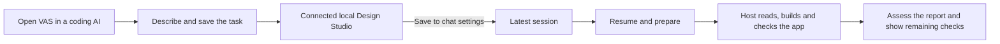
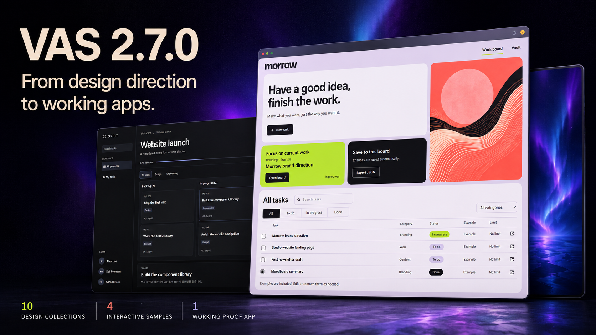

# VAS 2.9.0

**Describe the work. Choose the design. Continue with your coding AI.**

VAS (Vibecoding Agent System) connects a project brief, visual design choices and coding-agent instructions. Open the VAS folder in a coding AI, describe what you want, save the task locally, and compare designs in the connected Design Studio. The agent resumes the same settings, reads the real application, implements the requested work and reports the checks it actually performed.

**[Download VAS 2.9.0](https://github.com/zmsqnfl-commits/quintpact-vas/releases/tag/v2.9.0)** · **[Explore the Design Studio](https://zmsqnfl-commits.github.io/quintpact-vas/src/design-controller.html?v=2.9.0)** · **[Try Morrow](https://zmsqnfl-commits.github.io/quintpact-vas/src/proof-app/index.html?v=2.9.0)** · **[Read the release notes](docs/releases/2.9.0.md)**

## Start in the conversation

Open the extracted **VAS folder** as the coding tool's project and say, for example, “Build a reservation app with search and CSV export.” A host that reads project instructions identifies whether you want a new app, a change to an existing app, or development of VAS itself. It keeps the application's folder separate from VAS and asks only for information needed to proceed.

| Step | What you do | What VAS and the coding host do |
| --- | --- | --- |
| **1. Describe** | Explain the app or the change you need. | Identify the actual target, requirements, design scope and completion conditions. |
| **2. Save** | Continue the conversation; the agent tells you when it saves the settings locally. | Store a task summary on this PC, separate from the product files. Existing tasks can resume in a fresh conversation. |
| **3. Choose a design** | Ask to open this task's design screen. Compare samples and select **Save to chat settings**. | Update only the connected task's design and permitted design scope. Preserve unsaved drafts if another editor changes the settings. |
| **4. Continue** | Say “Use this design and build it,” or resume in a new conversation. | Read the latest session and use `prepare` to create instructions tied to its current revision and role resources. |
| **5. Build and check** | Continue working with your coding AI. | Read the actual app, implement within scope, delegate useful independent work when the host supports it, and inspect real test results. |
| **6. Review the result** | Review what changed and any remaining checks. | Use `assess` to compare the report with the current handoff and original completion conditions. Keep reported status, VAS assessment and user confirmation separate. |


```mermaid
flowchart LR
  A[Open VAS in a coding AI] --> B[Describe and save the task]
  B --> C[Connected local Design Studio]
  C -->|Save to chat settings| D[Latest session]
  D --> E[Resume and prepare]
  E --> F[Host reads, builds and checks the app]
  F --> G[Assess the report and show remaining checks]
```

Saving a design does not wake the AI or change its active conversation context. The main agent reads the latest settings before the next request, implementation, delegation or settings write. A fresh conversation resumes settings on the **same PC and VAS installation**; multiple tasks require an explicit selection. Moving VAS or switching PCs does not migrate sessions automatically.

You can also use the established screen-based workflow: run `Run-VAS-System.bat`, fill in the brief, choose a design, and copy the prompt into your coding tool with the actual project folder open. Exporting `VAS-AI-HANDOFF.json` remains optional. See [chat start](docs/CHAT-START.md), [saved settings](docs/CHAT-STATE.md), [connected design](docs/CHAT-DESIGN.md) and [implementation and verification](docs/CHAT-EXECUTION.md).

## What's new in VAS 2.9.0

### Saved tasks and a connected design screen

Task settings retain requirements, constraints, design scope, completion conditions and open questions. Actual target paths stay in separate local bindings outside the VAS product folder. Missing or replaced targets require review; concurrent updates use revision checks to reject stale writes. Settings are context for the next task, not stored execution permission or proof of a previous result.

The local Design Studio connects to a task you explicitly select. It checks for updates about every four seconds while visible and when refocused, applies incoming settings when there are no unsaved edits, and keeps a draft when revisions conflict. **Save to chat settings** commits the choice; opening or changing a sample does not. Session themes and undo history stay separate from other tasks and standalone design settings. Browser responses contain public settings and target status, without the private target path.

Existing applications preserve their layout, colors, fonts and components by default. Partial changes require named screens, elements or properties; a redesign requires an explicit choice. Active design handoffs retain the confirmed tokens, profile rules and reference information instead of substituting a generic preset.

### Settings connected to actual implementation

The `prepare` CLI creates a handoff linked to the selected session, revision, settings hash and role-resource hash. A missing task request or required completion condition leaves the response at `needs-input`. The coding agent then reads the actual app and follows its stack, rules and test commands. If useful independent work can be delegated through real host tools, the main agent supplies the full role instructions, file ownership, design scope and completion conditions, then retrieves and checks the results. Otherwise it performs the work sequentially.

The `assess` CLI checks the result's handoff ID, hash, source type and iteration against the current settings. Changed settings or role resources invalidate an old result. Failed checks, blockers and scope violations remain incomplete. Agent-submitted passing checks do not create direct user confirmation, so unconfirmed required conditions remain `needs-verification`. Neither CLI command runs application code or tests, certifies another AI's execution, or adds a new approval step for already authorized work.

### Supported environments and limits

- **Local Windows workflow:** Windows 10 or 11, PowerShell 5.1 or later, Python 3.10+ for chat-session commands, and a coding host with file and command tools. The host must be able to access VAS's private local settings store.
- **Host-dependent capabilities:** Instruction discovery, browser control and subagent tools depend on the coding tool and its permissions. Native role files alone do not prove that a role was invoked. Restricted Windows hosts can report a settings-store access failure; VAS does not weaken permissions automatically.
- **Static previews:** GitHub Pages and standalone HTML support visual comparison. They do not connect to the PC's session store or execute an application.
- **Verification scope:** Actual host tool records establish what ran. Browser checks of a generated app or CSV contents do not establish native Excel behavior, direct file opening in every browser, or user acceptance. Interrupted or timed-out host runs remain unverified until their outputs and remaining checks are reviewed.

The handoff v3 and result v1 contracts remain compatible. Version 2.9.0 retains the scope and evidence rules from [2.8.0](docs/releases/2.8.0.md), draft recovery and visual references from [2.8.1](docs/releases/2.8.1.md), and internal-record exclusions from [2.8.2](docs/releases/2.8.2.md). See the [completion policy](docs/completion-policy.md) for the meaning of each assessment status.

## What VAS helps you do

- **Start with your project.** Prepare a new project request or describe changes to an existing application. The coding agent reads the real source before making implementation decisions.
- **Choose a design you can see.** Compare 10 visual collections and 4 curated styles with interactive sample websites.
- **Carry the details into implementation.** The handoff includes the project requirements, selected design, confirmed tokens, references, role instructions, and verification expectations.
- **Keep implementation accountable.** The workflow asks the coding agent to inspect, plan, build, review, correct problems, and report the checks it actually ran.

VAS prepares the handoff. Implementation runs in your coding host, such as Codex, Claude, or Antigravity, using that host's available tools and permissions.



## Design directions with real previews

The Design Studio combines distinct compositions, typography, colors, imagery, spacing, and interaction guidance. You can refine the selected style and carry those settings into a sample before copying the handoff.

| Collection | Visual direction | Good fit |
| --- | --- | --- |
| Bento Studio | Irregular modular layouts, lavender and lime, expressive graphics | Creative studios and personal workspaces |
| Aurora Glass | Dark atmosphere and translucent panels | Immersive product interfaces |
| Clay Pop | Soft peach colors and rounded 3D objects | Learning and friendly consumer products |
| Noir Luxe | Dark surfaces, champagne accents, editorial serif type | Premium brands and product showcases |
| Botanical Atelier | Botanical photography, olive tones, warm ivory | Lifestyle and wellness |
| Retro Sunset | Warm retro colors and record-inspired compositions | Music and independent brands |
| Swiss Poster | Strong type, disciplined grids, exhibition-style hierarchy | Events, portfolios, and editorial pages |
| Cyber Deck | Technical consoles and high-contrast information | Developer tools and operational interfaces |
| Kinetic Type | Oversized typography with controllable motion | Creative campaigns and studio presentations |
| Paper Collage | Layered photographs and tactile editorial compositions | Visual storytelling and publications |

The main picker offers **14 curated choices**. The full set of 28 preset definitions remains available for compatibility with earlier saved selections. Fonts, artwork, and preview media are bundled locally, with font license files included.

### Four sample websites you can actually explore

Open these examples from the [Design Studio](https://zmsqnfl-commits.github.io/quintpact-vas/src/design-controller.html?v=2.9.0). Each recommendation includes a screenshot of its rendered site.

| Style | Sample | Working interactions |
| --- | --- | --- |
| Awwwards | **FORM / FIELD** architecture studio | Project disclosures, section navigation, inquiry preview |
| Linear | **ORBIT** project board | Task search, task creation, status changes |
| Stripe | **RELAY** subscription service | Monthly/yearly billing comparison, plan selection |
| Notion | **FIELDNOTES** team wiki | Document search, document opening, checklist updates |

These are demonstrations: inquiry previews do not send messages, and subscription examples do not process payments. Exploring another sample preserves the design settings you started with. Fictional sample content is a visual reference, not your project's business data.

## The screen-based handoff workflow

| Step | What happens |
| --- | --- |
| **1. Describe** | Choose a new or existing project, describe the work, and add completion conditions with their verification methods. |
| **2. Design** | For an existing project, preserve its design or explicitly choose a change scope. For an active design, compare styles and confirm the tokens and references. |
| **3. Review and copy** | Review the final brief and copy the generated prompt. Saving `VAS-AI-HANDOFF.json` is optional. |
| **4. Inspect and build** | Open the actual project in your coding host and paste the prompt. The agent reads the source, plans the work, and implements it. |
| **5. Verify and improve** | The agent checks the result, corrects identified issues, and reports evidence and remaining limits. |

You can close VAS after copying the prompt. Help can be reopened during setup, and work-memory preferences can be changed again on the completion screen.

### Agent roles and execution

VAS includes shared role instructions and native agent definitions for supported hosts. When a host supports only general subagents, the workflow requires the full role text, task scope, assigned files, design rules, and completion criteria to be passed into each delegated task.

The main agent remains responsible for collecting results, reviewing evidence, routing corrections, and repeating affected checks. Reviewers are instructed to inspect without editing source files. These instructions operate within the host's actual permissions; they do not create a separate security sandbox.

For existing applications, the **Read Before Generate** rule requires the coding agent to inspect the real files and preserve the project's technology stack. VAS does not infer the application's architecture from a folder path.

See the [handoff guide](docs/HANDOFF.md) and [agent workflow](.agents/HANDOFF-WORKFLOW.md) for the detailed execution contract.

## Morrow: built through the VAS workflow

[Morrow](https://zmsqnfl-commits.github.io/quintpact-vas/src/proof-app/index.html?v=2.9.0) is a working creative task board built with the Bento Studio direction. Its development used a real five-step VAS project form, an exported handoff, a generated design concept, separate implementation, and independent review.

You can create and edit tasks, set categories and due dates, combine search and status filters, mark work complete, archive and restore tasks, undo the latest deletion, and export records as JSON. Data persists in the browser, with empty states, input validation, and storage-error guidance.

Verification covered keyboard interaction, responsive layouts at 1440, 768, 390, and 320 pixels, and persistence after creating a 5,001st task. It found and corrected dialog focus handling, small mobile completion targets, and a save/reload limit mismatch.

Morrow stores data locally in the browser. It has no accounts, backend, AI API connection, JSON import, or cross-device synchronization. The cover above is a promotional composition based on the application and sample screens.

The [verification record](docs/verification/README.md) includes the request, original handoff, design specification, and execution results. The original development handoff retains its VAS 2.6.4 version and integrity hash.

## Get started on Windows

**Requirements:** Windows 10 or 11 with PowerShell 5.1 or later. Chat-session commands also need Python 3.10+ available to the coding host. VAS does not bundle a Python interpreter or a coding AI.

1. Open the [v2.9.0 release](https://github.com/zmsqnfl-commits/quintpact-vas/releases/tag/v2.9.0) and download `VAS-2.9.0-windows.zip`.
2. Extract the entire archive into a stable folder.
3. Open that VAS folder in a coding AI that reads its project instructions, then describe the work. Open a fresh conversation after upgrading the instructions.
4. Ask to open the task's design screen when you want a visual comparison. Save the design to the connected task and continue in the conversation.
5. Review the agent's actual changes, checks and remaining conditions. A saved setting or prepared handoff is not a completed app.

For the screen-based alternative, double-click `Run-VAS-System.bat`, choose a new or existing project, fill in the brief and design scope, then copy the prompt into your coding tool with the real application folder open. The separate `VAS-Client-Form-2.9.0.zip` contains a standalone request form for sharing. Downloads include `SHA256SUMS.txt` and `release-manifest.json` for artifact verification.

When upgrading, keep a backup of the previous installation and user data. Sessions are associated with the VAS installation path: a new extraction at a different path does not automatically discover the old installation's tasks. Do not assume that copying the VAS folder moves its private settings store. The [settings guide](docs/CHAT-STATE.md) explains these boundaries. Existing handoff formats and standalone design selections remain compatible.

For the Korean quick-start guide, see [00-처음-사용하기.txt](00-처음-사용하기.txt).

## Privacy and project boundaries

- Work memory is opt-in and uses confirmed design selections for recommendations. Raw work-memory records are not included in the handoff.
- In the screen-based flow, the existing project path belongs in the copied prompt. Chat sessions additionally keep a private local binding for resume; the path is excluded from shared settings, handoff JSON, browser responses and work-memory records.
- Preparing a handoff does not run, copy, or modify the existing target project.
- Runtime pages use local assets and fonts without external font services or CDNs.

## Verification and development

The [2.9.0 release notes](docs/releases/2.9.0.md) describe the release scope and verification boundaries. [GitHub Actions](https://github.com/zmsqnfl-commits/quintpact-vas/actions) records published workflow runs. Release checks and a coding AI's actual application work are different evidence sources.

The required gates cover Python contracts and local storage, browser workflows, session/design integration, Windows HTTP behavior and extracted-package contents. Actual-host checks exercise instruction discovery, saved-task resume and result linkage separately. A successful implementation/reviewer delegation exercise does not mean every app run uses subagents; tools and execution records determine that for each run. An application's remaining manual checks stay visible even when its automated checks pass.

The release workflow runs Windows runtime and extracted-package checks before the remaining validation and publication jobs. The [completion policy](docs/completion-policy.md) explains why agent-reported `complete` can still receive a VAS assessment of `needs-verification`.

For source development, install the Node and Python test dependencies and Chromium, then run the checks from the repository directory:

```powershell
npm.cmd ci
python -m pip install -r tests/requirements-dev.txt
npx.cmd playwright install chromium

npm.cmd run agents:build
npm.cmd run knowledge:index
npm.cmd run test:python
npm.cmd run test:browser
npm.cmd run test:package
npm.cmd run agent:security
```

On Windows, use a local or mapped-drive path when npm cannot run from a UNC directory. The optional `npm.cmd run test:release` command includes the ten-run stress suite; run it only when explicitly needed. `agent:verify` runs the actual Python and browser checks, while `agent:security` checks the generated release's file boundaries and source hashes.

| Location | Purpose |
| --- | --- |
| `src/` | Runtime pages, Design Studio, sample sites, and Morrow |
| `.agents/skills/` | Shared design and role instructions |
| `.codex/agents/`, `.claude/agents/` | Native agent definitions for supported hosts |
| `docs/` | Guides, release notes, and verification records |
| `scripts/`, `tests/` | Build tools and automated checks |
| `dist/` | Generated distributions; excluded from Git |

Further reading: [documentation index](docs/index.md) · [test guide](tests/README.md) · [asset notices](src/assets/README.md).

## License

VAS is distributed under the [MIT License](LICENSE). See [NOTICE.md](NOTICE.md) for third-party notices.
