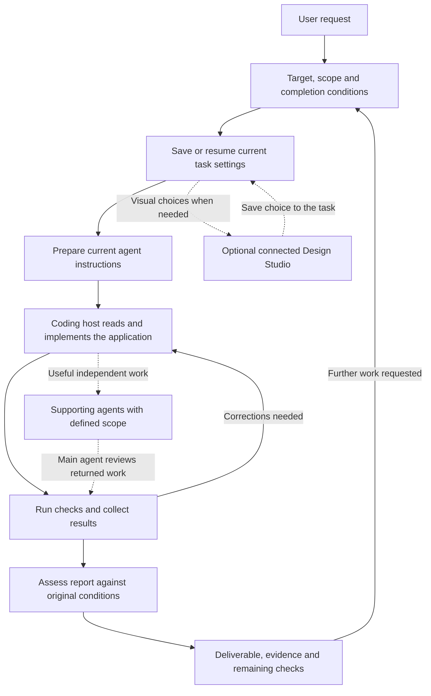

# VAS 2.9.2

**Keep coding agents aligned from request to delivery.**

VAS (Vibecoding Agent System) is a local workflow tool that helps coding agents turn a user's request into a working deliverable. It carries the agreed target, requirements, scope and completion conditions through task setup, implementation, verification and follow-up work.

The main agent uses VAS to save and resume task settings, prepare current instructions, share a defined scope with supporting agents when useful, and compare reported results with the original requirements. Your coding host supplies the actual file, command, browser and delegation tools. Design choices are one part of that task context, used when the work needs them.

**[Download VAS 2.9.2](https://github.com/zmsqnfl-commits/quintpact-vas/releases/tag/v2.9.2)** · **[Get started](#get-started-on-windows)** · **[Implementation and verification](docs/CHAT-EXECUTION.md)** · **[Release notes](docs/releases/2.9.2.md)**

## One connected workflow

Open the extracted **VAS folder** in a coding AI that reads project instructions and describe the work. For example: “Add CSV export to my existing app, keep the current screens, and check that Korean text and totals are preserved.” The agent identifies the actual application, reads its rules and source, and asks only for missing information that affects the work.

| Stage | How VAS helps the agent move the work forward |
| --- | --- |
| **1. Clarify the task** | Separate the VAS tool from the application being built or changed. Carry the target, required behavior, allowed scope and completion conditions together. |
| **2. Keep usable context** | Save the agreed settings locally and resume them in a fresh conversation. Read the latest revision before implementation, delegation or a settings update. |
| **3. Prepare the work** | Create instructions tied to the current settings and role resources. Surface missing requirements or review needs before treating the task as ready. |
| **4. Implement and coordinate** | Guide the coding host to read the actual project and follow its rules. When useful and supported, give other agents a defined responsibility, file scope and completion conditions. |
| **5. Check and correct** | Have the main agent collect changes and actual tool results, run the relevant checks, fix failures and recheck the affected behavior. |
| **6. Review and continue** | Compare the submitted report with the current handoff and original conditions. Show what changed, what was checked and what still needs verification; refresh the settings for further work. |


```mermaid
flowchart TD
  A[User request] --> B[Target, scope and completion conditions]
  B --> C[Save or resume current task settings]
  C --> D[Prepare current agent instructions]
  D --> E[Coding host reads and implements the application]
  E --> F[Run checks and collect results]
  F -->|Corrections needed| E
  F --> G[Assess report against original conditions]
  G --> H[Deliverable, evidence and remaining checks]
  H -->|Further work requested| B
  E -. Useful independent work .-> R[Supporting agents with defined scope]
  R -. Main agent reviews returned work .-> F
  C -. Visual choices when needed .-> V[Optional connected Design Studio]
  V -. Save choice to the task .-> C
```

The coding host performs the implementation and verification steps. VAS provides the settings, instructions and comparison tools that support this workflow; host capabilities and permissions determine which actions can actually run.

## What stays connected

- **The request and the real project.** New applications, existing applications and VAS development are distinguished at the start. The agent reads the target project's own instructions, stack and source before making changes.
- **The current settings and the next action.** Local sessions retain requirements, constraints, design scope, completion conditions and open questions. Revision checks reject stale writes; missing or replaced targets require review.
- **The main agent and delegated work.** Role instructions carry the agreed target, responsibilities, file ownership and checks. The main agent retrieves and reviews the results, resolves problems and reports the combined outcome.
- **The implementation report and the original conditions.** Prepared handoffs are linked to the session, settings and role resources. Assessment rejects mismatched reports and keeps failed checks, blockers and unverified conditions visible.
- **Today's setup and the next conversation.** On the same PC and VAS installation, the agent can resume a saved settings summary and recheck the current application. Saved settings do not restore an entire chat transcript or prove that interrupted work finished.

These capabilities support feature work, bug fixes and existing-project changes as well as new applications. Existing UI is preserved by default unless the requested scope calls for a change.

## Get started on Windows

**Requirements:** Windows 10 or 11 with PowerShell 5.1 or later. Chat-session commands also need Python 3.10+ available to the coding host. VAS does not bundle a Python interpreter or a coding AI.

1. Open the [v2.9.2 release](https://github.com/zmsqnfl-commits/quintpact-vas/releases/tag/v2.9.2) and download `VAS-2.9.2-windows.zip`.
2. Extract the entire archive into a stable folder.
3. Open that VAS folder in a coding AI that reads its project instructions, then describe the work. Open a fresh conversation after upgrading the instructions.
4. Continue in the conversation. The main agent saves the agreed settings, prepares the work, reads the target project, and uses its available tools to implement and check it. Visual choices can be added when the task needs them.
5. Review the deliverable, actual checks and remaining conditions. To continue later on the same PC and installation, ask to resume the saved task; the agent rechecks the current files before proceeding.

For the screen-based alternative, double-click `Run-VAS-System.bat`, choose a new or existing project, fill in the brief and design scope, then copy the prompt into your coding tool with the real application folder open. The separate `VAS-Client-Form-2.9.2.zip` contains a standalone request form for sharing. Downloads include `SHA256SUMS.txt` and `release-manifest.json` for artifact verification.

When upgrading, keep a backup of the previous installation and user data. Sessions are associated with the VAS installation path: a new extraction at a different path does not automatically discover the old installation's tasks. Do not assume that copying the VAS folder moves its private settings store. The [settings guide](docs/CHAT-STATE.md) explains these boundaries. Existing handoff formats and standalone design selections remain compatible.

For the Korean quick-start guide, see [00-처음-사용하기.txt](00-처음-사용하기.txt).

## Working with agents

VAS provides a shared workflow for the main coding agent and role instructions for supporting work. Native definitions are included for supported Codex and Claude environments; actual availability depends on the host and its permissions.

When independent work would help, the main agent can delegate implementation, design or review with the current task context and a clear file scope. It remains responsible for collecting the result, inspecting the changes and verifying the combined application. If delegation is unavailable or unnecessary, the main agent performs the work in sequence.

The host handles the session commands and result format. Users can continue with ordinary requests such as “Build this,” “Fix this part,” or “Resume the saved task.” A role file by itself is not evidence that an agent ran. See the [execution guide](docs/CHAT-EXECUTION.md) and [agent workflow](.agents/HANDOFF-WORKFLOW.md).

`prepare` creates an instruction package; `assess` compares submitted evidence with the current task. Actual code changes and test execution come from the coding host. Agent reports, VAS assessment and user acceptance remain separate: an agent-reported pass can still need direct verification. Further work uses refreshed settings and a new preparation; automatic iteration numbering and linked result history are not provided.

## What's new in VAS 2.9.2

This patch strengthens the storage and privacy boundaries that help the agent continue a task reliably.

- **Resume older tasks safely.** Tasks affected only by updated privacy rules open as sanitized views, with fields marked for review. The main agent reviews and saves the full settings before preparing further work; unrelated valid tasks remain usable.
- **Bound memory recovery files.** Backups, corrupt originals and recognized temporary files have explicit limits. Capacity and cleanup failures preserve existing data and report what needs attention.
- **Protect runtime credentials and state paths.** Restricted Windows file permissions apply before credentials are written, unsafe state paths are rejected, and launcher output excludes the token.
- **Improve shared-data handling.** Bounded encoded-credential detection and quoted optional RAG references strengthen the handoff boundary while keeping normal text usable.
- **Report recovery and request errors clearly.** Invalid or oversized requests have specific responses; tested paths cover task settings, preparation, assessment and restart.

The established handoff v3 / result v1 contracts, consent rules and saved-task workflow remain available. Read the [detailed changes and upgrade guidance](docs/releases/2.9.2.md) and [operations guide](docs/OPERATIONS.md) for limits and recovery behavior.

## A working deliverable: Morrow

[Morrow](https://zmsqnfl-commits.github.io/quintpact-vas/src/proof-app/index.html?v=2.9.2) is a task-board application built through an earlier VAS handoff workflow, with separate implementation and independent review. It demonstrates a concrete request becoming an application with testable behavior.

You can create and edit tasks, search and filter them, manage due dates and status, archive and restore records, undo the latest deletion, and export JSON. Data persists in the browser. Verification covered keyboard interaction, responsive layouts at 1440, 768, 390 and 320 pixels, and persistence after a 5,001st task. Review found and corrected focus handling, small mobile controls and a save/reload limit mismatch.

The [verification record](docs/verification/README.md) links the request, original handoff, specification and execution results. It is an earlier application example: its original handoff retains VAS 2.6.4 and does not demonstrate every later chat-session feature. Morrow has no accounts, backend, AI API connection, JSON import or cross-device synchronization.

## Design support when the task needs it

The connected Design Studio helps users and agents agree on visual requirements and save them to the same task. It is optional in the conversational workflow. Existing applications preserve their design by default; partial changes name the affected screens or elements, while a redesign requires an explicit choice.

When you use it, **Save to chat settings** commits the selection. The main agent reads the latest settings before continuing. Opening a sample or saving a design does not wake the AI or replace its active conversation context. GitHub Pages previews are separate from the PC's private task store.

[Explore the Design Studio](https://zmsqnfl-commits.github.io/quintpact-vas/src/design-controller.html?v=2.9.2) · [Connect a local task](docs/CHAT-DESIGN.md)

<details>
<summary>View design collections and interactive samples</summary>

### Design directions with real previews

The Design Studio combines distinct compositions, typography, colors, imagery, spacing, and interaction guidance. You can refine the selected style and carry those settings into a sample before copying the handoff.

| Collection | Visual direction | Good fit |
| --- | --- | --- |
| Bento Studio | Irregular modular layouts, lavender and lime, expressive graphics | Creative studios and personal workspaces |
| Aurora Glass | Dark atmosphere and translucent panels | Immersive product interfaces |
| Clay Pop | Soft peach colors and rounded 3D objects | Learning and friendly consumer products |
| Noir Luxe | Dark surfaces, champagne accents, editorial serif type | Premium brands and product showcases |
| Botanical Atelier | Botanical photography, olive tones, warm ivory | Lifestyle and wellness |
| Retro Sunset | Warm retro colors and record-inspired compositions | Music and independent brands |
| Swiss Poster | Strong type, disciplined grids, exhibition-style hierarchy | Events, portfolios, and editorial pages |
| Cyber Deck | Technical consoles and high-contrast information | Developer tools and operational interfaces |
| Kinetic Type | Oversized typography with controllable motion | Creative campaigns and studio presentations |
| Paper Collage | Layered photographs and tactile editorial compositions | Visual storytelling and publications |

The main picker offers **14 curated choices**. The full set of 28 preset definitions remains available for compatibility with earlier saved selections. Fonts, artwork, and preview media are bundled locally, with font license files included.

### Four interactive sample websites

Open these examples from the [Design Studio](https://zmsqnfl-commits.github.io/quintpact-vas/src/design-controller.html?v=2.9.2). Each recommendation includes a screenshot of its rendered site.

| Style | Sample | Working interactions |
| --- | --- | --- |
| Awwwards | **FORM / FIELD** architecture studio | Project disclosures, section navigation, inquiry preview |
| Linear | **ORBIT** project board | Task search, task creation, status changes |
| Stripe | **RELAY** subscription service | Monthly/yearly billing comparison, plan selection |
| Notion | **FIELDNOTES** team wiki | Document search, document opening, checklist updates |

These are demonstrations: inquiry previews do not send messages, and subscription examples do not process payments. Exploring another sample preserves the design settings you started with. Fictional sample content is a visual reference, not your project's business data.


The image is an earlier promotional composition of the app and design samples.

</details>

## Privacy and project boundaries

- Work memory is opt-in and uses confirmed design selections for recommendations. The Windows server enforces consent and the cumulative 10,000-event / 8 MiB limit. Raw work-memory records are not included in the handoff.
- In the screen-based flow, the existing project path belongs in the copied prompt. Chat sessions additionally keep a private local binding for resume; the path is excluded from shared settings, handoff JSON, browser responses and work-memory records.
- Preparing a handoff does not run, copy, or modify the existing target project.
- Runtime pages use local assets and fonts without external font services or CDNs.

## Verification and development

The [2.9.2 release notes](docs/releases/2.9.2.md) describe the release scope and verification boundaries. [GitHub Actions](https://github.com/zmsqnfl-commits/quintpact-vas/actions) records published workflow runs. Release checks and a coding AI's actual application work are different evidence sources.

The required gates cover Python contracts and local storage, browser workflows, session/design integration, Windows HTTP behavior and extracted-package contents. Actual-host checks exercise instruction discovery, saved-task resume and result linkage separately. A successful implementation/reviewer delegation exercise does not mean every app run uses subagents; tools and execution records determine that for each run. An application's remaining manual checks stay visible even when its automated checks pass.

The release workflow runs Windows runtime and extracted-package checks before the remaining validation and publication jobs. The [completion policy](docs/completion-policy.md) explains why agent-reported `complete` can still receive a VAS assessment of `needs-verification`.

For source development, install the Node and Python test dependencies and Chromium, then run the checks from the repository directory:

```powershell
npm.cmd ci
python -m pip install -r tests/requirements-dev.txt
npx.cmd playwright install chromium

npm.cmd run agents:build
npm.cmd run knowledge:index
npm.cmd run test:python
npm.cmd run test:browser
npm.cmd run test:package
npm.cmd run agent:security
```

On Windows, use a local or mapped-drive path when npm cannot run from a UNC directory. The optional `npm.cmd run test:release` command includes the ten-run stress suite; run it only when explicitly needed. `agent:verify` runs the actual Python and browser checks, while `agent:security` checks the generated release's file boundaries and source hashes.

| Location | Purpose |
| --- | --- |
| `src/` | Setup screens, shared handoff contracts, optional design tools and example apps |
| `.agents/` | Task bootstrap, session, execution and role instructions |
| `.codex/agents/`, `.claude/agents/` | Native agent definitions for supported hosts |
| `docs/` | Guides, release notes, and verification records |
| `scripts/`, `tests/` | Session preparation and assessment, local runtime, builds and automated checks |
| `dist/` | Generated distributions; excluded from Git |

Further reading: [documentation index](docs/index.md) · [test guide](tests/README.md) · [asset notices](src/assets/README.md).

## License

VAS is distributed under the [MIT License](LICENSE). See [NOTICE.md](NOTICE.md) for third-party notices.
