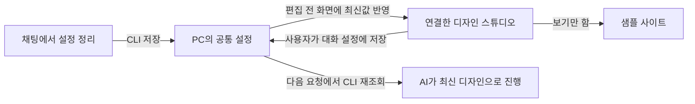

# 채팅과 디자인 화면 연결

VAS 2.9.0은 채팅에서 준비한 작업과 로컬 디자인 스튜디오가 같은 저장 설정을 사용하도록 연결합니다. 설명을 폼에 다시 입력하지 않고 스타일을 눈으로 비교한 뒤 해당 작업에 저장할 수 있습니다.

## 연결해서 사용하기

1. 코딩 AI에서 VAS 폴더를 열고 만들거나 고칠 앱을 설명합니다. AI가 실제 대상과 설정을 저장한 뒤 “이 작업의 디자인 화면 열어줘”라고 요청합니다.
2. AI가 해당 세션을 확인하고 로컬 VAS를 실행해 연결된 스튜디오를 엽니다. 직접 연 로컬 스튜디오에서는 채팅 작업 목록에서 원하는 작업을 선택할 수도 있습니다. 최근 작업을 자동으로 선택하지 않습니다.
3. 연결 패널에서 작업 이름·요구사항·완료조건·디자인 범위를 확인합니다. 프리셋·취향·세부 토큰·디자인 방향을 조정하고 샘플 사이트로 결과를 비교합니다.
4. **대화 설정에 저장**을 누릅니다. 성공 표시가 나면 같은 세션에 디자인이 저장됩니다. 조정 중인 화면은 저장 전 초안입니다.
5. 채팅에서 “이 디자인으로 진행해줘”처럼 이어서 요청합니다. AI가 최신 설정을 다시 읽고 해당 범위에 따라 작업을 진행합니다.

Windows 로컬 런타임과 Python 3.10+가 필요합니다. 코딩 호스트에 실행·브라우저 도구가 없으면 실제로 열었거나 저장했다고 표시하지 않고 사용 가능한 방식으로 안내합니다. 독립 HTML이나 GitHub Pages에서는 스타일 비교만 제공하며 PC의 대화 설정과 연결되지 않습니다.

코딩 호스트도 PC 전용 설정 저장소를 읽을 수 있어야 합니다. 일부 제한된 Windows 호스트는 VAS 프로젝트 폴더를 열어도 보호된 저장소에 접근하지 못합니다. 이 경우 화면 저장과 별개로 대화의 자동 재개는 사용할 수 없으며 `session_store_unavailable`을 알립니다. 연결 기능은 저장소 접근 권한이 있는 로컬 호스트를 지원합니다. VAS가 Windows 권한을 자동으로 완화하지 않습니다.

## 양방향 반영 방식

화면은 보이는 동안 약 4초마다, 다시 보이거나 포커스를 받을 때 최신 설정을 확인합니다. 저장 전 편집이 없으면 채팅에서 바꾼 디자인을 화면에 반영합니다. 서로 다른 세션의 테마와 되돌리기 이력은 섞이지 않으며 기존 공통 브라우저 테마도 가져오지 않습니다.

화면 저장은 AI를 깨우거나 모델의 대화 문맥을 자동 갱신하지 않습니다. 주 실행자가 다음 요청·구현·역할 위임·설정 저장 전에 CLI로 최신 세션을 다시 읽습니다. 진행 중인 하위 작업에 변경을 전달하는 것도 주 실행자가 담당합니다.

## 기존 디자인과 변경 범위

| 범위 | 화면과 작업 동작 |
|---|---|
| 새 앱 | 새 디자인을 선택하고 세부 설정을 저장 |
| 기존 디자인 유지 | 기존 앱의 구성·글꼴·색상을 유지하며 새 디자인 설정은 비움 |
| 부분 디자인 수정 | 사용자가 바꿀 화면·요소·속성을 명시한 범위만 적용 |
| 전체 리디자인 | 사용자가 해당 범위를 명시적으로 선택한 경우에 적용 |

기존 앱은 디자인 유지가 기본입니다. 다른 스타일을 미리 봤다는 이유로 범위가 바뀌지 않습니다. 연결 화면은 디자인과 디자인 변경 범위만 저장하며 작업 요구사항·완료조건·질문을 임의로 바꾸지 않습니다. 부분 수정은 범위 입력이 필요합니다.

샘플 사이트는 읽기 전용 비교 화면입니다. 샘플에서 스타일을 바꾸거나 돌아오는 것만으로 대화 설정을 저장하지 않습니다. 실제 적용할 선택은 스튜디오에서 확인하고 저장합니다.

직접 작성한 디자인 값 중 화면에서 표현할 수 없는 항목은 안내를 표시합니다. 방향 설명이나 범위만 고치면 원래 디자인 값을 보존하며, 스타일·세부 디자인을 직접 바꾸면 화면의 디자인 설정으로 교체합니다.

## 동시 변경과 연결 오류

- 채팅이나 다른 탭에서 먼저 저장하면 저장 버전(revision)이 달라집니다. 편집 중인 화면은 초안을 유지하고 변경 확인 안내를 표시합니다.
- 오래된 화면의 저장은 거부됩니다. 내 변경을 버리고 최신 설정을 불러오는 버튼을 직접 선택한 뒤 필요하면 다시 편집합니다. 초안을 자동으로 병합하거나 덮어쓰지 않습니다.
- 로컬 서버가 꺼졌거나 저장이 실패하면 초안을 유지하고 연결 오류를 알립니다. 저장되지 않은 내용을 저장됐다고 표시하지 않습니다.
- 대상 폴더가 사라지거나 교체되면 채팅에서 실제 대상을 확인하고 다시 연결합니다. 화면에서 다른 폴더를 추정하거나 대상 앱을 실행하지 않습니다.
- 저장 전 초안은 화면 메모리에만 있습니다. 새로고침·탭 종료로 잃을 수 있으므로 성공 표시를 확인하세요.

## 연결 정보와 저장 범위

로컬 디자인 주소의 `session` 값은 특정 작업을 고르는 32자리 세션 ID입니다. 인증된 로컬 런타임에서만 설정을 조회·저장합니다. 주소에 들어가는 실행 인증값은 공유 문서나 저장소에 기록하지 않습니다.

브라우저에는 공유 가능한 설정과 대상 확인 상태만 전달하며 절대 작업 폴더 경로·디렉터리 식별자·PC 전용 binding을 보내지 않습니다. 웹 서버는 대상 앱 파일을 생성·수정·실행하지 않습니다. 설정 저장은 앱 구현이나 검증의 완료를 뜻하지 않으며 실제 실행·위임·완료 확인은 코딩 호스트의 작업과 결과로 확인합니다.

관련 안내: [대화 시작](CHAT-START.md), [설정 저장과 재개](CHAT-STATE.md), [구현과 검증](CHAT-EXECUTION.md), [에이전트 저장 절차](../.agents/SESSION.md).
