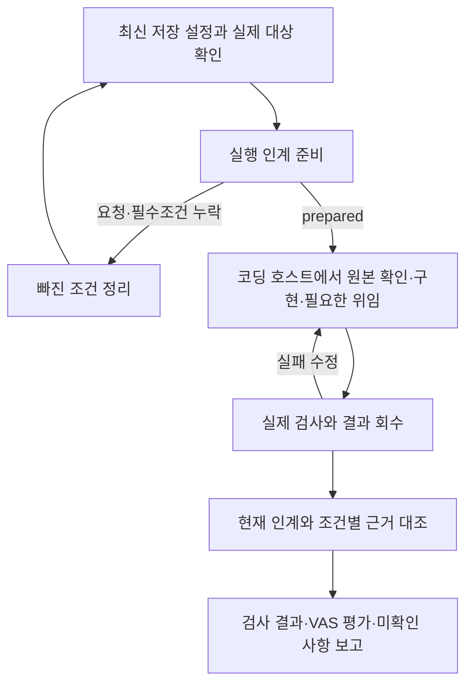

# 저장한 설정으로 구현과 검증 이어가기

VAS 2.9.0은 대화·디자인 화면에서 정한 설정을 코딩 호스트의 실제 작업에 연결합니다. 사용자에게 결과 JSON 작성을 요구하지 않으며 주 실행자가 설정 조회·인계 준비·결과 대조를 담당합니다.

## 사용 순서

1. VAS 폴더를 코딩 AI에서 열고 만들거나 수정할 앱을 설명합니다. [저장 설정](CHAT-STATE.md)과 [디자인 화면](CHAT-DESIGN.md)에서 대상·요청·디자인 범위·완료조건을 정합니다.
2. “이 설정으로 만들어줘”라고 요청합니다. AI가 최신 설정을 읽고 실제 대상 상태를 확인한 뒤 `prepare`로 실행 인계를 준비합니다.
3. 요청과 필수 완료조건이 있어야 `prepared`가 됩니다. 빠졌다면 `needs-input`과 누락 목록을 반환합니다. 요청에서 명확한 조건은 AI가 정리하며 결과에 영향을 주는 모호함만 질문합니다.
4. AI가 앱의 지침·원본·실제 검사 명령을 읽고 구현합니다. 위임 도구가 있고 독립 작업이 유용하면 담당 파일과 역할 전체 지침을 전달해 위임합니다. 위임할 수 없으면 주 실행자가 순서대로 수행합니다.
5. 주 실행자가 실제 호출 결과와 변경을 회수하고 검사 명령·종료 코드·조건별 근거를 확인합니다. 실패를 수정한 뒤 관련 검사를 다시 실행합니다.
6. `assess`로 결과를 최신 인계·원래 완료조건과 대조하고, 변경 내용·실제 통과 검사·남은 미확인 조건을 알려줍니다.

계획만 요청했다면 구현을 시작하지 않습니다. 이미 승인된 구현과 일반 검증을 진행하기 위해 별도 승인 절차를 추가하지 않습니다. `prepare`와 `assess`는 앱 파일을 스캔·수정·실행하거나 테스트를 대신 돌리지 않습니다.



## 작업 범위와 설정 변경

- 기존 앱의 `preserve`는 구성·글꼴·색상·레이아웃을 유지합니다. `partial`은 명시된 화면·요소·속성만 바꿉니다. 새 앱은 확정한 디자인 방향·프로필 규칙·전체 토큰을 적용합니다.
- 인계는 세션 ID·revision·설정 해시·역할 자료 해시에 연결합니다. 해시는 자료의 일치 여부를 확인하며 실행·검증 성공을 증명하지 않습니다.
- 구현·위임·결과 취합 직전에 최신 설정을 확인합니다. 바뀌었으면 새 지시와 진행 중인 작업을 대조하고 영향을 받는 검사를 다시 실행합니다. 오래된 결과의 ID만 바꿔 최신 결과로 제출하지 않습니다.
- 주 실행자만 세션을 저장합니다. 하위 에이전트는 변경 제안과 실제 수행 결과를 반환합니다. 역할 파일의 존재를 실제 호출 증거로 간주하지 않습니다.
- 화면 저장은 AI를 깨우지 않습니다. 다음 상호작용에서 주 실행자가 최신 설정을 다시 읽고 필요한 하위 작업에 전달합니다.

## 실제 검사·VAS 평가·사용자 확인

| 구분 | 확인하는 내용 |
|---|---|
| 실제 검사 | 코딩 호스트에서 실행한 명령·종료 코드·산출물 관찰. 미실행 항목도 보고 |
| AI 보고 `reportedStatus` | AI가 결과 JSON에 적은 상태. 단독으로 실행 증거가 되지 않음 |
| VAS 평가 `assessment` | 원래 조건과 제출 근거 대조. 실패·blocker·범위 위반은 `incomplete`, 직접 확인이 없는 필수조건은 `needs-verification` |
| 사용자 직접 확인·수용 | 사용자가 실제 결과를 확인하거나 다음 작업에 쓰기로 한 별도 사실 |

현재 대화 실행 CLI는 사용자 확인 관찰을 입력받지 않습니다. 실제 자동검사가 통과했더라도 AI 제출 자료만으로 `complete`를 인증하지 않습니다. 결과에 `verified`·`user-direct` 같은 표시를 적어도 사용자 확인 기록이 생기지 않습니다. 검사 통과와 평가의 미확인 상태를 함께 설명할 수 있습니다. 자세한 기준은 [작업 범위와 완료 확인](completion-policy.md)에 있습니다.

## 코딩 호스트의 명령과 결과 형식

아래 명령은 주 실행자용입니다. `ID`와 `N`은 최신 `resume`에서 확인한 세션 ID와 revision으로 바꾸며, 다른 작업 폴더에서는 VAS 스크립트의 실제 경로를 사용합니다.

```text
python scripts/vas-session.py prepare --session ID --expected-revision N
```

응답의 `status`·`missing`·`sessionId`·`revision`·`handoff`를 확인합니다. `target.path`는 로컬 실행 도구에만 사용하고 공유 인계나 보고서에 복사하지 않습니다. 인계 내부 `workflow.status: ready`만으로 실행 준비 성공을 판단하지 않습니다.

실제 작업 후 결과 v1 JSON을 UTF-8 표준입력으로 다음 명령에 전달합니다. 명령은 현재 인계 ID·해시·작업 종류·반복 번호와 결과를 대조하며 설정이나 앱 파일을 수정하지 않습니다. 결과 평가를 세션의 완료 표시로 저장하지도 않습니다.

```text
python scripts/vas-session.py assess --session ID --expected-revision N
```

다음은 기존 앱의 CSV 검사를 보고하는 **형식 예시**입니다. 그대로 제출하지 마세요. `handoffId`, `handoffPayloadSha256`, `sourceType`, `iteration`에는 `prepare` 응답의 `handoff.workflow.handoffId`, `handoff.integrity.payloadSha256`, `handoff.project.sourceType`, `handoff.workflow.iteration` 값을 각각 넣습니다. `resultId`는 새 보고의 고유 ID이며, `artifactVersion`은 실제 검사한 앱의 commit·파일 해시 등입니다. 조건 ID·방법·파일·검사 결과도 실제 작업과 일치해야 합니다.

```json
{
  "format": "vas-ai-result",
  "schemaVersion": 1,
  "resultId": "r_example_export_001",
  "handoffId": "h_00000000000000000000000000000000",
  "handoffPayloadSha256": "0000000000000000000000000000000000000000000000000000000000000000",
  "sourceType": "existing",
  "iteration": 1,
  "status": "complete",
  "generatedBy": {"tool": "coding-host"},
  "artifactVersion": "git:0123456",
  "readback": {
    "checkedFiles": ["src/export.js", "package.json"],
    "commands": [{"kind": "test", "command": "npm run test:csv", "source": "package.json"}]
  },
  "changes": {
    "summary": "기존 화면 구성을 유지하며 CSV 내보내기를 추가했습니다.",
    "relativeFiles": [{"path": "src/export.js", "action": "modified"}]
  },
  "tests": [{
    "name": "CSV 내보내기",
    "command": "npm run test:csv",
    "status": "passed",
    "summary": "종료 코드 0. 한글 보존과 합계 일치 검사를 통과했습니다."
  }],
  "evidence": [{
    "criterionId": "C1",
    "artifactVersion": "git:0123456",
    "method": "automatic",
    "outcome": "passed",
    "summary": "한글 보존과 합계 일치 자동검사 통과. 사용자 직접 확인은 미실시."
  }],
  "remaining": [],
  "scopeViolation": false,
  "safety": {
    "absolutePathsExcluded": true,
    "secretsExcluded": true,
    "rawCommandOutputExcluded": true
  }
}
```

`status: complete`는 이 예시의 AI 보고값입니다. 연결 정보가 일치하고 필수조건 C1의 통과 보고만 있다면 VAS 평가는 `needs-verification`입니다. 실패·미실행을 통과로 적지 말고 실제 상태와 남은 항목을 기록하세요. 숫자 필드는 문자열·불리언으로 바꾸지 않습니다. 조건별 `evidence`에 같은 검사 대상 버전을 사용하며 절대 경로·비밀값·원시 로그를 제외한 요약만 넣습니다. `safety` 값도 실제로 제외했을 때만 표시하며 보안 검사 통과를 뜻하지 않습니다.

## 실행 환경의 한계

Python 3.10+, 실제 작업 도구, PC 전용 저장소 접근이 필요합니다. 일부 제한된 Windows 호스트는 프로젝트 폴더를 열어도 저장소를 읽지 못합니다. 이 경우 실패를 알리고 접근 권한을 자동 완화하거나 다른 저장소로 몰래 전환하지 않습니다. 호스트의 실제 도구·권한과 관찰 가능한 결과 범위에서 진행합니다.

한 실행에서 역할 위임이 확인됐더라도 다른 실행까지 확인된 것은 아닙니다. 각 실행의 실제 호출 ID·반환 결과를 확인해야 하며, 순차 실행을 여러 에이전트가 수행했다고 보고하지 않습니다. 코딩 호스트가 중단되거나 시간 초과되면 남은 파일·검사·결과 제출 상태부터 다시 확인합니다. 저장된 설정만으로 중단된 구현이 완료됐다고 처리하지 않습니다.

브라우저에서 CSV 내용과 한글 인코딩을 검사한 결과는 실제 Excel에서 열어 확인한 결과와 구분합니다. 로컬 서버에서 확인한 화면도 직접 파일 열기와 모든 브라우저의 동작을 보증하지 않습니다. 필요한 수동 검사가 남았다면 실제 자동검사 통과와 함께 미확인 항목을 보고합니다.

관련 절차: [에이전트 실행 지침](../.agents/EXECUTION.md), [대화 시작](CHAT-START.md), [설정 저장](CHAT-STATE.md), [디자인 연결](CHAT-DESIGN.md).
