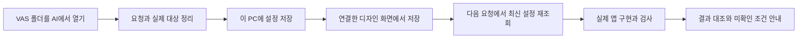

# 대화로 시작하기

VAS 폴더를 코딩 AI의 프로젝트로 열고 “예약 관리 앱 만들어줘”처럼 요청하세요. 프로젝트 시작 지침을 읽는 호스트에서는 별도로 지침 읽기·BAT 실행·폼 작성·프롬프트 복사를 지시하지 않아도 대화로 작업을 정리합니다.

## VAS 2.9.0에서 시작하기

- 새 앱 제작, 기존 앱 수정, VAS 자체 개발을 구분합니다.
- 명확한 요청은 자동으로 분류하고, 대상이나 필요한 조건이 빠졌을 때만 질문합니다.
- VAS 본체와 사용자 앱의 작업 폴더를 구분합니다. 새 앱의 기본 후보는 `workspace/<앱 이름>`이며 기존 내용은 덮어쓰지 않습니다.
- 기존 앱의 규칙과 원본을 먼저 읽고, 명시적 변경 요청이 없으면 디자인을 유지합니다.
- 같은 대화의 후속 요청과 위임받은 작업에서는 시작 질문을 반복하지 않습니다.

Python 3.10+를 실행할 수 있는 호스트에서는 공통 CLI로 설정 요약을 저장하고 새 대화에서 이어갑니다. 실제 저장·조회 성공 응답을 확인한 경우에만 복원됐다고 표시합니다. 여러 작업이 있거나 폴더가 바뀌면 대상을 확인합니다. [설정 저장과 재개](CHAT-STATE.md)를 참고하세요.

저장한 작업을 로컬 디자인 스튜디오에 연결할 수 있습니다. 화면에서 저장한 디자인을 AI가 다음 요청에서 다시 읽고, 채팅에서 바꾼 설정은 편집 중이 아닌 연결 화면에 반영됩니다. 화면 저장 자체가 AI를 실행시키지는 않습니다. [채팅과 디자인 화면 연결](CHAT-DESIGN.md)을 참고하세요.

“이 설정으로 만들어줘”라고 요청하면 AI가 최신 설정으로 실행 인계를 준비하고, 실제 앱 원본을 읽어 구현·필요한 위임·검증을 수행합니다. 작업 요청과 필수 완료조건이 있어야 준비가 완료됩니다. 요청에서 명확한 조건은 AI가 정리하고, 결과에 영향을 주는 모호함만 질문합니다. 실제 도구 실행과 조건별 근거를 확인한 뒤 결과를 최신 인계와 대조합니다. [구현과 검증으로 이어가기](CHAT-EXECUTION.md)를 참고하세요.

## 요청 예시

| 요청 | 시작 동작 |
|---|---|
| 예약 관리 앱 만들어줘 | 새 앱으로 분류하고 목적·필수 기능·작업 폴더를 정리 |
| 지정한 기존 앱에 CSV 내보내기 추가해줘 | 대상 원본 확인, 기존 디자인 유지, 완료조건 정리 |
| VAS의 인계 JSON 기능을 고쳐줘 | VAS 개발 규칙으로 해당 제품 기능 수정 |
| 버튼 고쳐줘 | 연결된 대상이 없을 때만 어느 앱인지 확인 |
| 이 구조에 대한 계획만 세워줘 | 계획 작성, 앱 파일 생성이나 구현은 시작하지 않음 |

## 호스트와 실행 시점

첫 메시지를 처리하는 호스트가 프로젝트 지침을 읽어야 자동 시작이 가능합니다. 폴더 선택만으로 백그라운드 프로세스나 AI가 실행되지는 않습니다. 호스트의 사용자 규칙·보안 정책·프로젝트 신뢰 설정을 따릅니다.

| 진입 파일 | 용도 |
|---|---|
| `AGENTS.md` | Codex 및 이 파일을 읽는 호스트 |
| `CLAUDE.md`, `GEMINI.md` | 해당 파일을 읽도록 설정된 호스트 |
| `.cursorrules`, `.windsurfrules` | 해당 형식을 읽는 호스트의 호환 진입 파일 |

위 파일은 모두 같은 원본에서 생성하며 핵심 시작 절차를 직접 포함합니다. 추가 지침 파일을 여는 도구가 없어도 이미 읽힌 절차로 대화를 시작할 수 있습니다. 파일 제공은 모든 제품·버전에서 자동 로드·브라우저 제어·서브에이전트 호출이 검증됐다는 뜻은 아닙니다. 화면이나 위임 도구가 없으면 주 실행자가 대화와 실제 사용 가능한 도구로 순서대로 작업합니다.

코딩 호스트에는 실제 앱 작업 권한과 PC 전용 설정 저장소 접근이 필요합니다. 제한된 Windows 호스트가 저장소를 읽지 못하면 자동 재개·실행 준비를 성공으로 표시하지 않습니다. VAS가 접근 권한을 자동으로 풀지는 않습니다.

설정은 같은 PC의 같은 VAS 설치 위치에서 재개합니다. VAS를 옮기거나 새 경로에 압축 해제하면 이전 설정이 자동 연결되지 않습니다. 기존 설치와 사용자 데이터를 보관하고 [설정 저장 안내](CHAT-STATE.md)의 이동 제한을 확인하세요.

Codex의 지침 탐색은 세션 시작 때 이뤄집니다. 이미 열려 있던 세션은 새 세션에서 갱신된 지침을 확인하세요. Codex 공식 AGENTS.md 안내를 기준으로 하며 원문 링크는 저장소 README에 있습니다.

## 화면으로 설정하기

`Run-VAS-System.bat`를 실행하는 기존 [UI 설정·프롬프트 전달 방식](HANDOFF.md)도 사용할 수 있습니다. 채팅 작업과 함께 쓰려면 AI에게 “이 작업의 디자인 화면 열어줘”라고 요청하거나 로컬 스튜디오의 작업 목록에서 직접 연결합니다. `대화 설정에 저장`을 눌러야 화면의 선택이 해당 작업에 저장됩니다. 독립 HTML·GitHub Pages는 로컬 대화 설정에 연결되지 않습니다.

## 지침 관리와 검증

- 공통 진입 원본: [ENTRYPOINT.md](../.agents/ENTRYPOINT.md)
- 시작 절차: [BOOTSTRAP.md](../.agents/BOOTSTRAP.md)
- VAS 자체 개발: [DEVELOPMENT.md](../.agents/DEVELOPMENT.md)
- `npm run agents:build`로 루트 지침·네이티브 역할을 생성하고 `npm run agents:check`로 누락·불일치를 확인합니다.
- 패키지 검사는 실제 ZIP의 진입 파일·연결된 문서·원본 일치를 확인합니다. 실제 첫 응답 검증은 별도 호스트 실행으로 확인해야 합니다.
